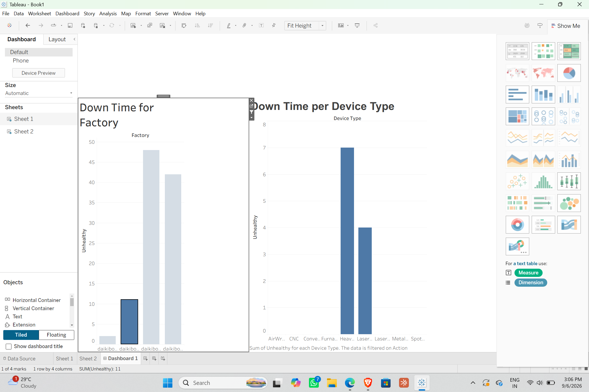

# Deloitte Data Analytics Job Simulation – Forage

## 📊 Overview

Completed the **Deloitte Data Analytics Job Simulation** through **Forage**, gaining hands-on experience in data analytics and forensic technology.

Worked with datasets to identify patterns, analyze business information, and communicate insights through data visualization.

## 🛠️ Skills & Tools

- Data Analysis & Cleaning
- Data Visualization
- Forensic Technology
- Business Analytics
- Tableau
- Excel
- Analytical Problem Solving

## 📌 Key Work

- Analyzed structured datasets and identified patterns
- Explored factory and device downtime data
- Created visualizations to communicate findings
- Interpreted data to generate business insights

## 📈 Visualization

Analyzed **factory downtime by device type** to identify patterns in operational downtime.

## 🎓 Learning Outcomes

Strengthened my understanding of:

- Real-world data analysis workflows
- Data visualization and interpretation
- Data-driven problem solving
- Communicating analytical insights

## 📜 Certification

Completed the **Deloitte Australia Data Analytics Job Simulation** through **Forage**.

## 🔗 Profile

[Connect with me on LinkedIn](https://www.linkedin.com/feed/update/urn:li:activity:7502317280480083968/)

---

### #DataAnalytics #DataAnalysis #DataScience #Deloitte #Forage
